# Infra Backlog · self-updating ops dashboard

**One board that the team never types into.** A scheduled AI task reads e-mail, Teams, calendar, the Daily meeting notes and the ITSM queue (ServiceDesk Plus). It then republishes a prioritized backlog in which every claim is labelled **FACT / PROBABLE / HYPOTHESIS** with its source and time.

> 🔗 **Live demo:** https://netorojas.github.io/infra-backlog-dashboard/
> 🧪 All people, tickets and numbers are **fictional** (company "Contoso Global").

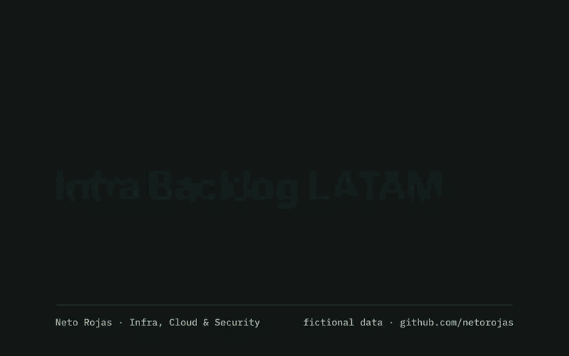

▶️ [Full 1-minute v2 walkthrough (MP4)](docs/media/backlog-demo.mp4)


## ✨ v3 — new themes, AGPL open-core, localhost kit

- **Two themes with character:** a bright *overworld* light theme (sky, coin gold, pipe green) and a deep *night-navy* dark theme with old-gold accents. Colour only — no symbols.
- **36 integrations** in Settings, now including NetBox, Veeam, Commvault, Terraform Cloud, Ansible AWX, GitHub/Azure DevOps, HashiCorp Vault, Prometheus, Splunk and Okta.
- **Runs anywhere:** `./serve.sh`, `.\serve.ps1` or `docker compose up -d` (see below).
- **Licence:** AGPL-3.0-or-later community edition + commercial licence ([COMMERCIAL.md](COMMERCIAL.md)).
- Works as one suite with [Orbinoc](https://github.com/netorojas/knoc-network-ops-console) (formerly KNOC).

## ✨ What's new in v2 — Contoso Ops Suite

Both tools now share one enterprise portal shell, with a different accent per product (teal → indigo).

| | |
|---|---|
| **Responsive + mobile** | Drawer navigation, bottom sheets and touch targets. The board, filters and tabs reflow down to 360 px. |
| **Sign-in (demo)** | Microsoft Entra ID, Google, GitHub and a dedicated **enterprise SSO** path (SAML 2.0 / OIDC, domain discovery). Simulated: no password field exists anywhere. |
| **Settings** | General, **26 integration blueprints** (ServiceNow, Jira Service Management, ServiceDesk Plus, Zabbix, Datadog, Sentinel, Teams, Slack, PagerDuty, FortiGate API…), Auth & SSO (OIDC, SAML, SCIM, MFA, roles), notifications, data & privacy, API & webhooks |
| **Secure by default** | Connectors are read-only unless a CAB-approved write is enabled; secrets are a Key Vault *reference*, never a value |
| **Command palette** | ⌘K / Ctrl+K to jump to any page, integration or action |
| **Quick tour, FAQ, changelog** | 60-second guided tour, searchable FAQ, and a changelog covering both products |
| **Look & feel** | Light and dark themes, glass header, motion that respects *reduced motion* |

> 💡 The 60-second tour replaces the old 15-step one. Open Settings → Integrations → Jira and press **Test connection**.

| Sign-in | Integrations |
|---|---|
| 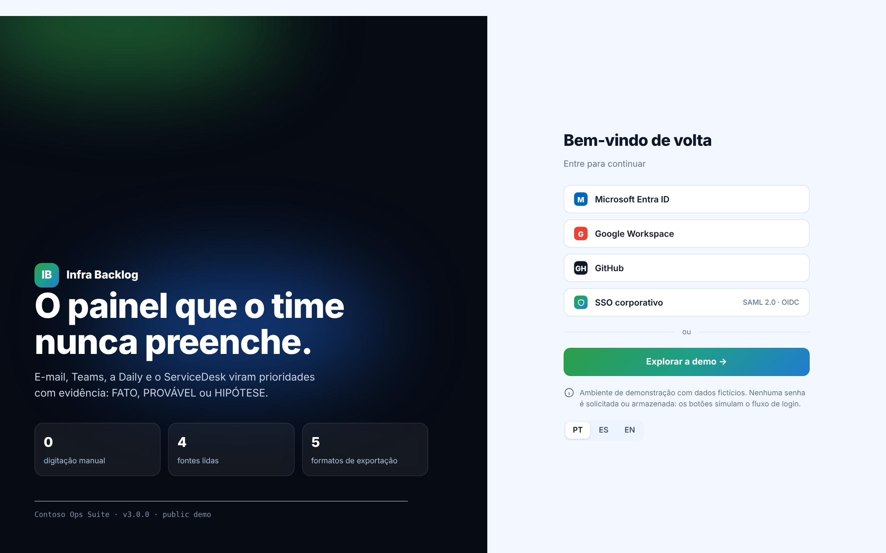 | 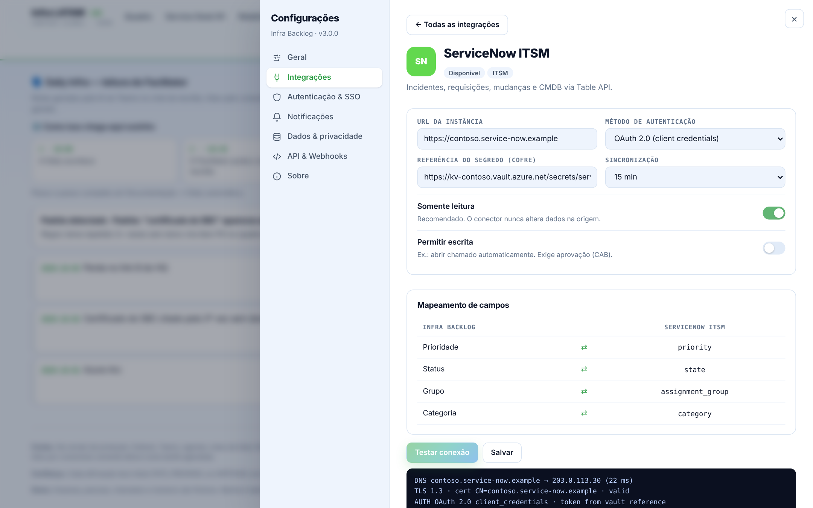 |
| 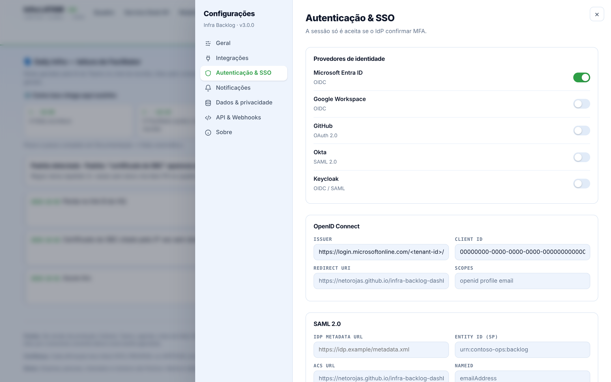 | 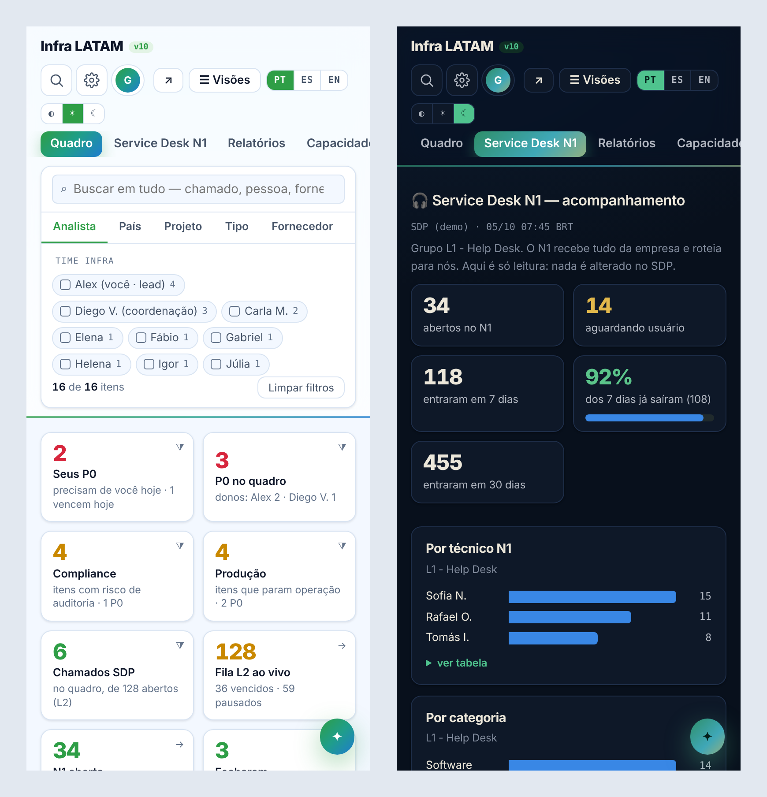 |

---

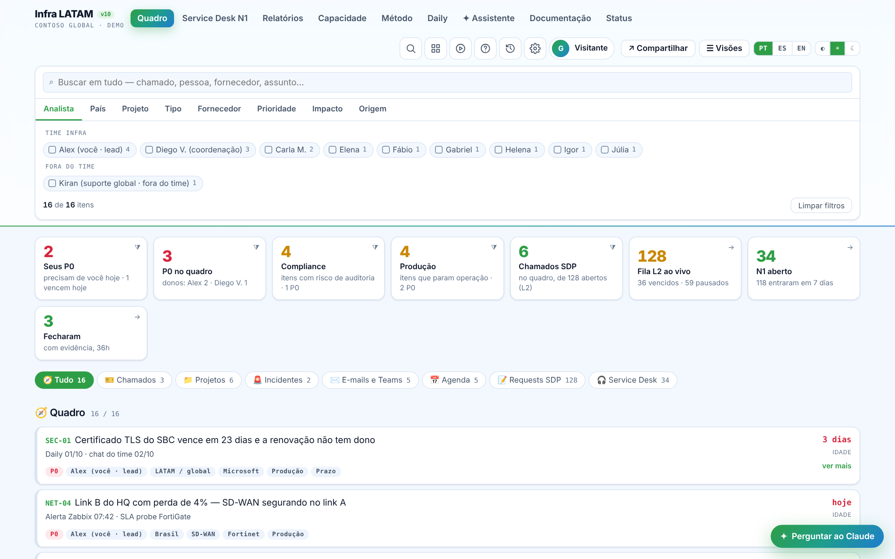

## The problem

A 9-person infra team across 9 countries had 35 parallel work fronts and more than 150 open L2 tickets. The real backlog lived in mailboxes, Teams chats and a daily meeting nobody wrote down. Overdue tickets kept rising **while the queue shrank**, which meant tickets were ageing rather than piling up, and nobody could see it.

## What it does

| Tab | Purpose |
|---|---|
| **Board** | A single backlog with multi-select filters (analyst, country, project, type, vendor, priority, impact, source) and clickable KPIs |
| **Service Desk L1** | A read-only watch of the L1 queue, plus a "may escalate to L2" radar |
| **Reports** | Per-analyst scoreboard, ageing buckets and an interactive trend. Exports to XLSX, CSV, JSON, Markdown and HTML |
| **Capacity** | Demand mix, calendar focus time and a what-if simulator (automation, catalogue, extra FTE) |
| **Method** | Diagnosis of current vs. target way of working: work types, rituals, a mini-CAB change flow and severity levels |
| **Daily** | The Teams *Facilitator* recap is read automatically. A topic repeated in 3+ dailies with no owner becomes a P0 item |
| **Assistant** | Natural-language questions over the board data. It can apply filters but never changes anything |
| **Status** | Which sources and scheduled tasks are live, and which analysts are plugged in |

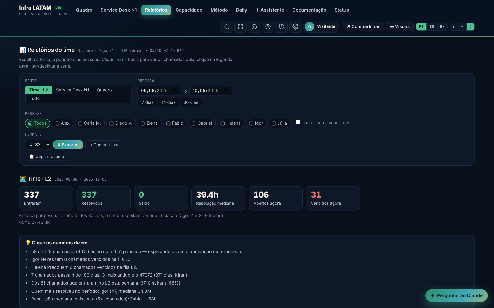

## Architecture

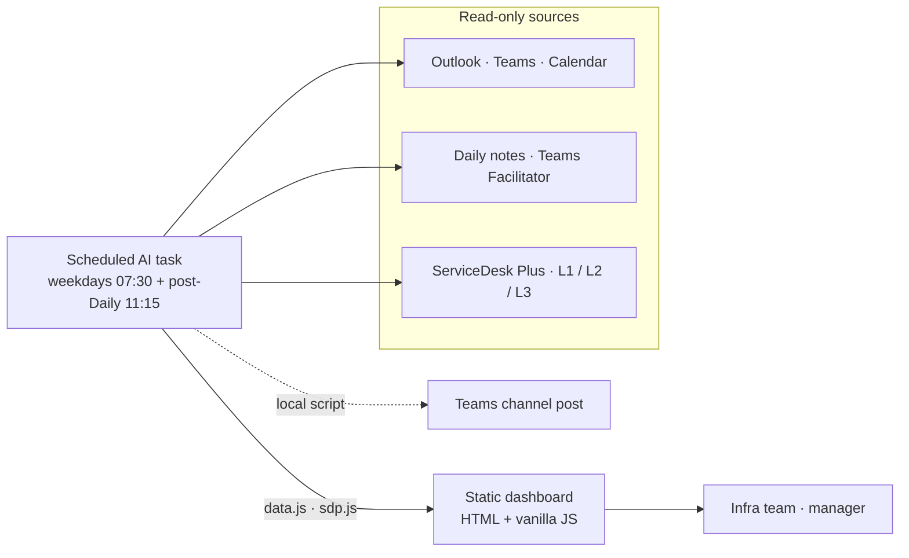

**Design decisions**

- **Read-only by default.** The connectors only read. Posting to Teams stays in a local script that uses the credentials the team already has, so no new broad admin consent is needed.
- **Evidence over opinion.** Every item carries who said it, when, and a confidence label. Stale items go to *Verify* and are never shown as fact.
- **Failure is visible.** If a connector is down, the board says so explicitly instead of showing an empty queue that looks healthy.
- **Measure ageing, not just volume.** The board tracks median age, overdue count and paused SLAs, not only the total.

## Screenshots

| Capacity | Method |
|---|---|
| 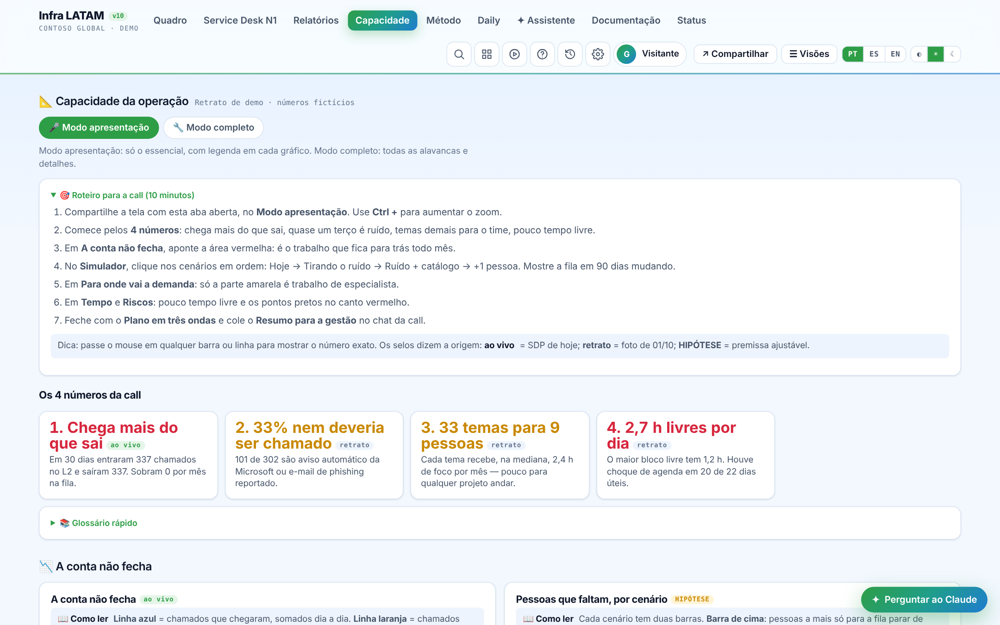 | 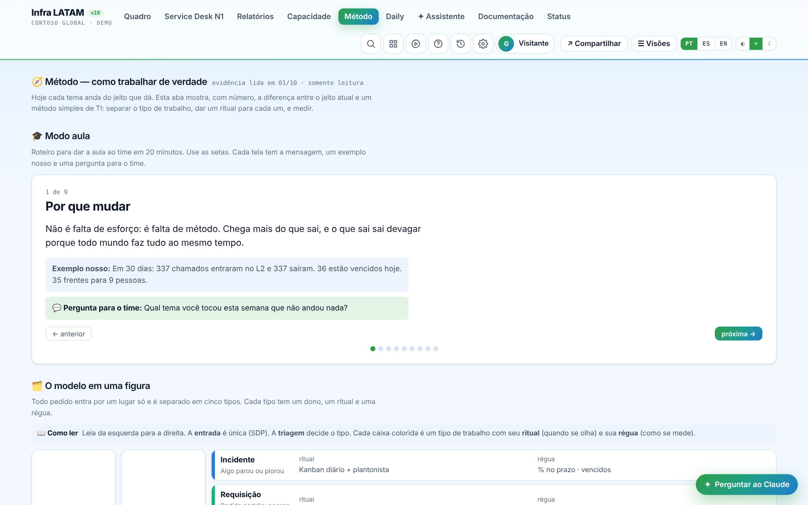 |
| **Daily** | **Service Desk L1** |
| 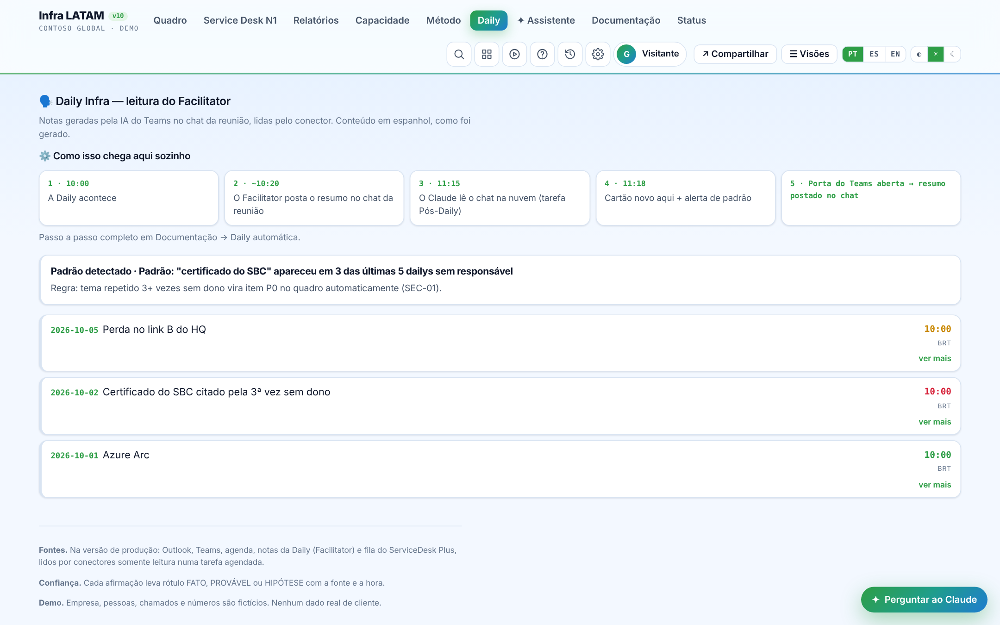 | 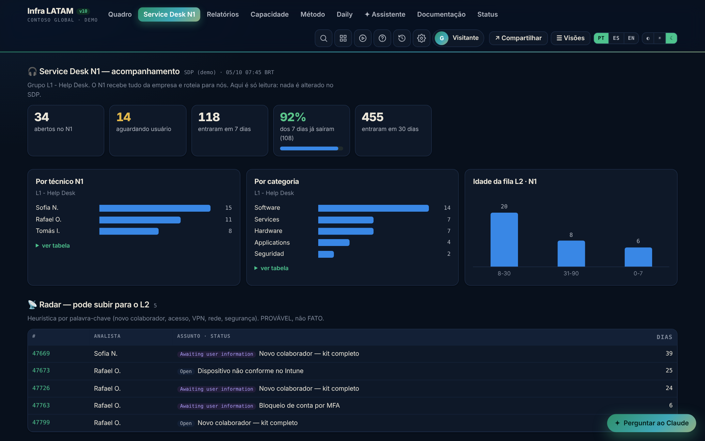 |

## Run it on your machine (localhost)

**macOS / Linux**
```bash
git clone https://github.com/netorojas/infra-backlog-dashboard.git
cd infra-backlog-dashboard
./serve.sh                 # opens http://localhost:8080/?nologin
```

**Windows (PowerShell)** — `.\serve.ps1`  ·  **Docker** — `docker compose up -d`

**Whole suite** (Backlog + Orbinoc with the suite switcher): clone both repos into the same folder and run `python3 -m http.server 8080 --bind 127.0.0.1` from that folder.

The **Assistant** and **Share** features need the original hosting runtime. In this static demo the assistant shows an "unavailable" notice and everything else works.

> A hosted multi-tenant version is on the roadmap. The localhost mode will stay.

## Licence

Open-core: **[AGPL-3.0-or-later](LICENSE)** community edition + **[commercial licence](COMMERCIAL.md)**. Releases up to v2.x remain MIT. See [NOTICE](NOTICE) and [CONTRIBUTING.md](CONTRIBUTING.md).

## Tech

Vanilla JavaScript split into modules (`data.js`, `sdp.js`, `cap.js`, `met.js`, `docs.js`, `assist.js`) plus the shared portal shell in `assets/`, with charts in inline SVG and CSS. It has a guided tour, three languages and light and dark themes. SheetJS is loaded from cdnjs only for the XLSX export.

---

**Author:** Ernesto Rojas (Neto), Infrastructure, Cloud & Security · ITSM · automation · [LinkedIn](https://www.linkedin.com/in/netorojas/)
🇧🇷 *Painel de backlog que se atualiza sozinho, com dados fictícios.* · 🇪🇸 *Panel de backlog que se actualiza solo, con datos ficticios.*
