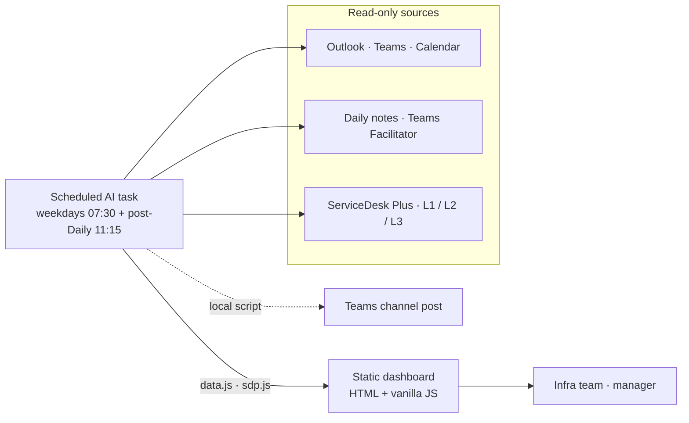

# Infra Backlog LATAM · self-updating ops dashboard

**One board that the team never types into.** A scheduled AI task reads e-mail, Teams, calendar, the Daily meeting notes and the ITSM queue (ServiceDesk Plus). It then republishes a prioritized backlog in which every claim is labelled **FACT / PROBABLE / HYPOTHESIS** with its source and time.

> 🔗 **Live demo:** https://netorojas.github.io/infra-backlog-dashboard/
> 🧪 All people, tickets and numbers are **fictional** (company "Contoso LATAM").


---

## The problem

A 9-person infra team across 9 countries had 35 parallel work fronts and more than 150 open L2 tickets. The real backlog lived in mailboxes, Teams chats and a daily meeting nobody wrote down. Overdue tickets kept rising **while the queue shrank**, which meant tickets were ageing rather than piling up, and nobody could see it.

## What it does

| Tab | Purpose |
|---|---|
| **Board** | A single backlog with multi-select filters (analyst, country, project, type, vendor, priority, impact, source) and clickable KPIs |
| **Service Desk L1** | A read-only watch of the L1 queue, plus a "may escalate to L2" radar |
| **Reports** | Per-analyst scoreboard, ageing buckets and an interactive trend. Exports to XLSX, CSV, JSON, Markdown and HTML |
| **Capacity** | Demand mix, calendar focus time and a what-if simulator (automation, catalogue, extra FTE) |
| **Method** | Diagnosis of current vs. target way of working: work types, rituals, a mini-CAB change flow and severity levels |
| **Daily** | The Teams *Facilitator* recap is read automatically. A topic repeated in 3+ dailies with no owner becomes a P0 item |
| **Assistant** | Natural-language questions over the board data. It can apply filters but never changes anything |
| **Status** | Which sources and scheduled tasks are live, and which analysts are plugged in |


## Architecture



**Design decisions**

- **Read-only by default.** The connectors only read. Posting to Teams stays in a local script that uses the credentials the team already has, so no new broad admin consent is needed.
- **Evidence over opinion.** Every item carries who said it, when, and a confidence label. Stale items go to *Verify* and are never shown as fact.
- **Failure is visible.** If a connector is down, the board says so explicitly instead of showing an empty queue that looks healthy.
- **Measure ageing, not just volume.** The board tracks median age, overdue count and paused SLAs, not only the total.

## Screenshots

| Capacity | Method |
|---|---|
|  |  |
| **Daily** | **Service Desk L1** |
|  |  |

## Run it locally

```bash
git clone https://github.com/netorojas/infra-backlog-dashboard.git
cd infra-backlog-dashboard
python3 -m http.server 8080   # then open http://localhost:8080
```

The **Assistant** and **Share** features need the original hosting runtime. In this static demo, the assistant shows an "unavailable" notice and everything else works.

## Tech

Vanilla JavaScript split into modules (`data.js`, `sdp.js`, `cap.js`, `met.js`, `docs.js`, `assist.js`, `tour.js`), with charts in inline SVG and CSS. It has a guided tour, three languages and light and dark themes. SheetJS is loaded from cdnjs only for the XLSX export.

---

**Author:** Ernesto Rojas (Neto), Senior Infrastructure Engineer · ITSM · automation · LATAM operations
🇧🇷 *Painel de backlog que se atualiza sozinho, com dados fictícios.* · 🇪🇸 *Panel de backlog que se actualiza solo, con datos ficticios.*
